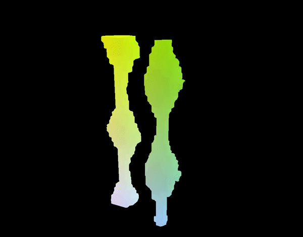
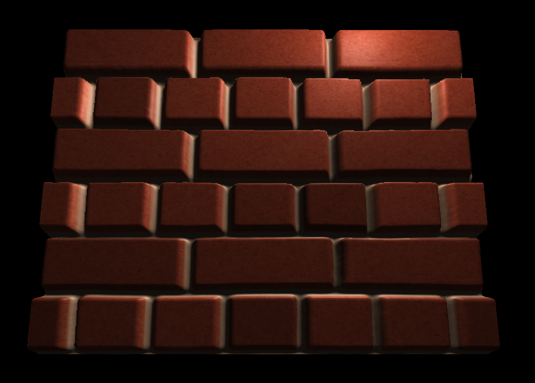
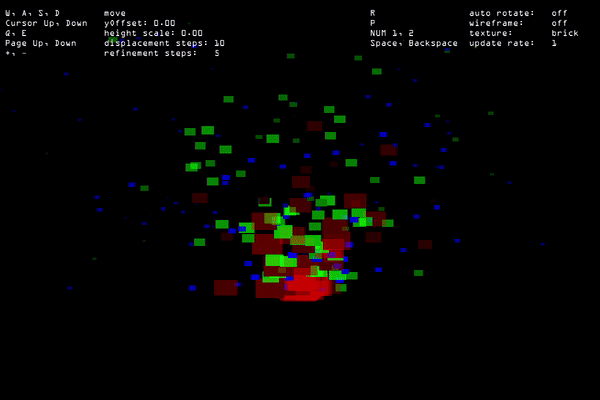

# Shader Programming Exercises

assignments for SPG (shader programming) @FHTechnikumWien

## Key Controls

| key        | action |
| :------------- | :----- |
| p      | toggle wireframe mode |
| r      | rotate displacement tile |
| 1, 2      | swap textures on displacement tile |
| Cursor UP, DOWN      | change offset for 3D texture and generate new geometry |
| +, -      | refinement steps |
| Q, E      | height scale for displacement tile |
| W, A, S, D      | controls to move the camera, look around with mouse |
| space, backspace | change particle update rate |
| mouse button | spawn a new particle emitter |

## MarchingCubes

### References

- [MARCHING CUBES: A HIGH RESOLUTION
3D SURFACE CONSTRUCTION ALGORITHM paper Siggraph 1987 [.pdf]](https://people.eecs.berkeley.edu/~jrs/meshpapers/LorensenCline.pdf)
- [Polygonising a scalar field by Paul Bourke](http://paulbourke.net/geometry/polygonise/)
- [GPU Gems 3 - Generating Complex Procedural Terrains Using the GPU](https://developer.nvidia.com/gpugems/gpugems3/part-i-geometry/chapter-1-generating-complex-procedural-terrains-using-gpu)

## Pixel Shader Displacement Mapping

### References

- [LearnOpenGL Parallax Mapping](https://learnopengl.com/Advanced-Lighting/Parallax-Mapping)
- [Youtube - OpenGL Game Rendering Tutorial: How Parallax Displacement Mapping Works](https://www.youtube.com/watch?v=xvOT62L-fQI)
- [Review of Displacement Mapping Techniques and Optimization - Ermin Hrkalovic, Mikael Lundgren](http://www.diva-portal.org/smash/get/diva2:831762/FULLTEXT01.pdf)

## GPU Particle System

### References
- [Megabyte Softworks Particle System](https://www.mbsoftworks.sk/tutorials/opengl3/23-particle-system/)
- OpenGL SuperBible
- [Youtube - theCherno Particle Demo Code Review](https://www.youtube.com/watch?v=kdJhCv7lCD4)

## Dependencies

- glad (glad.c need to be in source folder and compiled)
- glew
- glfw
- glm
- KHR
- stb (only stb_image.h needed)
- freetype
- OBJ_Loader
